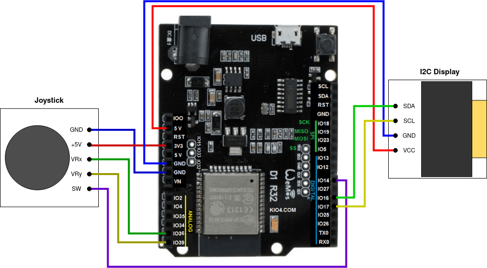

# **ESP32 - game using I2C display and proportional joystick**
### Author: `Dalibor Kříčka`
### 2023, Brno

Note: This project was part of the course _Microprocessors and Embedded Systems_ at BUT FIT.

---

## Task Description

This project aimed to to create a simple game for the ESP32 platform using a proportional joystick and an I2C display as input and output devices. The implemented game is the globally known **Ping Pong**. This game was chosen because of its low hardware requirements, needing to manage only three objects moving over time within a two-dimensional field.

## Device Configuration and Environment

This section describes the technologies used during the project development and explains the connection of peripherals to the ESP32 device.

### Technologies

A wide variety of technologies were used, so only the most important ones will be briefly described below.

#### ESP32

The ESP32 is a series of low-power, single-chip technologies. It features 4 MB Flash, 320 KB RAM, a 240 MHz Xtensa® dual-core 32-bit LX6 microprocessor, and several other functions (such as WiFi, Bluetooth, I2C, UART, 34 programmable GPIO pins, etc.).

#### I2C OLED Display

The display communicates with the board using the I2C interface. I2C is a synchronous serial communication protocol using a Master/Slave model and two wires:

- **SDA** (Serial Data) – data line,
- **SCL** (Serial Clock) – clock line.

The display uses OLED technology, known for its ability to completely turn off pixels for black color, providing a sharp contrast even at small resolutions like 128x64 pixels used here.

#### Proportional Joystick

The joystick includes two independent potentiometers for each axis (X and Y). Using an analog-to-digital converter (ADC), the position of the stick can be determined. The joystick also functions as a push-button. It uses the following wires:

- **VRx** – voltage proportional to X-axis,
- **VRy** – voltage proportional to Y-axis,
- **SW** – switch (button).

### IDF

IDF (Espressif IoT Development Framework) is a development framework for ESP32 microcontrollers. It offers a wide range of tools, libraries, and documentation. This project was developed in C, which is natively supported by IDF.

#### PlatformIO

PlatformIO is a development environment implemented as an extension for Visual Studio Code. It provides a unified platform for developing with the IDF framework. It allows easy project and device management and peripheral settings via a console-based UI.

### Wiring and Setup

Wiring was performed according to the function of each wire. The joystick's VRx and VRy wires were connected to analog GPIO36 and GPIO39 inputs. Their input values are captured with a 12-bit width (values from 0 to 4095). The SW button was connected to GPIO14 as a digital input. GPIO16 and GPIO17 were used and configured via Menuconfig for the display's SDA and SCL lines.

The joystick was powered by a 3.3V source because the ADC can only handle 12-bit resolution and cannot accurately represent voltages up to 5000 mV, which would be produced by a 5V power source.

>**Img. 1:** Schematic of peripheral connections to the ESP32 board.

## Implementation

The implementation used the previously mentioned IDF environment. The **ssd1306** library and the **font8x8_basic** header were used for display work, and **driver/adc.h** for reading analog joystick values.

### Library `ssd1306.h`

The `ssd1306` library provides functions for simple rendering of bitmaps, text, and lines on the I2C display. The most used function was `ssd1306_bitmaps`, which draws a predefined bitmap at specified X and Y coordinates.

Other frequently used functions:

- `ssd1306_clear_screen` – clears the display,
- `ssd1306_display_text` – renders text.

All ASCII characters are defined as 8-byte bitmaps in the **font8x8_basic** header.

#### Custom Library Modification

Physically, redrawing the screen (flushing the buffer to the display) is time-consuming. To achieve smoother gameplay (especially smoother object movement), the delay and physical redraw within `ssd1306_bitmaps` were removed. Instead, the display is only updated after the entire game frame has been rendered to the buffer.

### Game Logic

To simulate smooth animation and react to joystick input, the game state must be continuously updated based on a finite set of events: ball collisions with player or boundaries, user input, and game over.

#### Moving Objects

Game objects move by being redrawn to a new position over time. Before redrawing an object, its previous position must be cleared to avoid leaving trails.

Due to the display's small resolution, movements happen in pixel units. Larger jumps would disrupt game fluidity.

#### Player

The player is a movable game object represented by a rectangular bitmap and X/Y coordinates (top-left corner). The player's movement on the Y-axis is controlled by the joystick.

Because the joystick is proportional, the stick's tilt determines how many pixels the player moves per game update, resulting in three possible speeds in both directions.

#### Ball

Unlike the player, the ball has a defined direction vector for both X and Y axes. The ball continuously moves and changes direction upon:

- **Collision with the player** – inverts X direction,
- **Collision with top/bottom boundary** – inverts Y direction.

The collision acts like a reflection without gravity, maintaining the angle of incidence equal to the angle of reflection.

#### Collisions

Collision detection is done by comparing object positions. For two-dimensional objects, collision checks must account for the object's width and height when comparing positions.

#### Joystick Input

The default voltage produced by the joystick in its neutral position is approximately 1790 mV (observed). Significant deviations indicate movement:

- A decrease: joystick pushed upwards (move a player up),
- An increase: joystick pushed downwards (move a player down).

Thresholds define different speed levels based on how far the stick is moved from neutral.

## Project Features

The entire program is controlled solely by the joystick through movement and button presses. After a game round (from the start to a player's loss), the game can be restarted.

### Screens

The displayed content is organized into so-called **screens**:

1. **Welcome Screen**:
   - Displayed immediately after powering the microcontroller,
   - Stays visible for 5 seconds,
   - Shows project number, author, and year.

2. **Waiting Screen**:
   - Prompts the user to press the button to start the game,
   - The program waits for the button press,
   - Switches to the game screen upon button press.

3. **Game Screen**:
   - Shows the active gameplay,
   - After the game ends, it returns to the waiting screen.

### Gameplay

After pressing the button to start, a countdown is shown. When it finishes, the ball starts moving, and players must reflect the ball to the opponent's side. If a player fails to reflect the ball, he loses.

### Controls

The player is moved by tilting the joystick on the Y-axis. Three movement speeds are available depending on how much the stick is tilted. When the joystick is neutral, the player stays still.

Since the game is for two players but only one joystick is available, the game switches which player is controlled based on the ball's movement direction — the active player is always the one the ball is approaching.